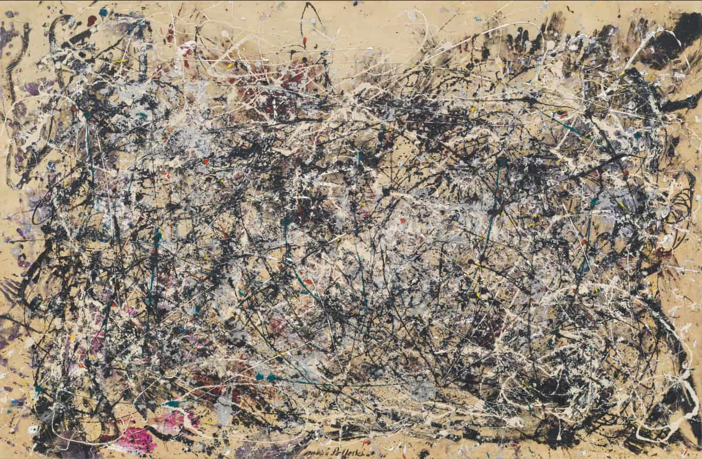
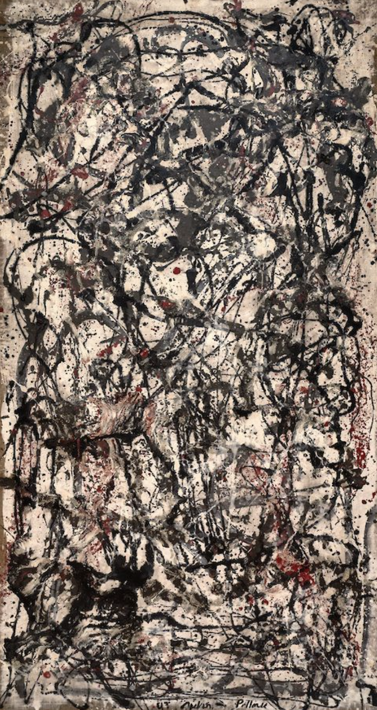
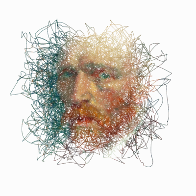
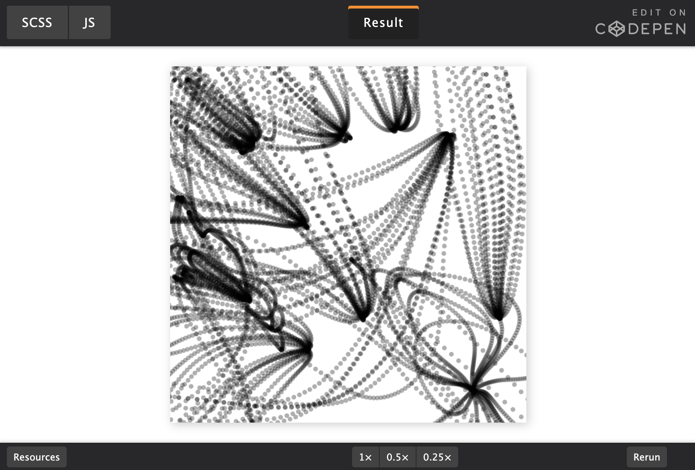
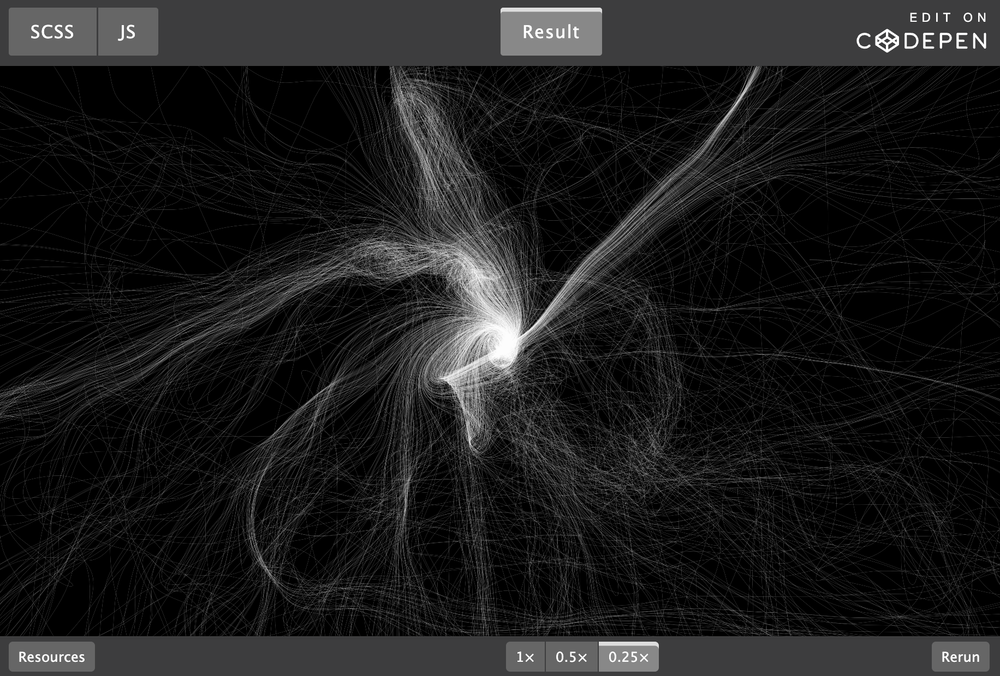

# zhxu0869_9103_week8quiz
## PART1:
Action painting was a trend in abstract art from the 1940s to the 1960s that existed within the framework of Abstract Expressionism. Jackson Pollock pioneered action painting. His representative work of ink splash painting "Number 1A" and “Enchanted Forest” uses random lines and random ink spots to convey his inner world, and also has a very strong visual impact. The random, intricate and tense lines in this painting inspired me. This line plays a big role when it comes to expressing the visual effects and vitality of the page, and it can be a very beneficial technique. 

## PART2:
This random line expression technique is generally called "Random Walk" in coding. The "Random Walk" mechanism allows lines to randomly extend from one point to the next, thus generating intricate, tortuous paths. As Dhruv Karan shows in p5.js generation art, random walks combined with Perlin noise can achieve a balance between "random" and "order", making the lines both free and beautiful. The “Random Walkers” tutorial of Generative Hut also points out that by controlling parameters such as step size, direction probability, and boundary rebound, the degree of chaos can be controlled, so that the work is dynamic and not completely messy.

Example implementation:
[Link Text](https://dhruvkaran.com/posts/recreating-paintings-with-p5js)
[Link Text](https://www.generativehut.com/post/random-walkers)